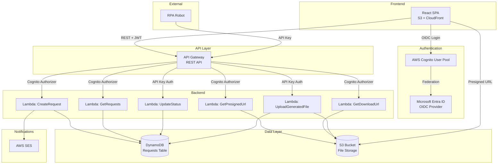
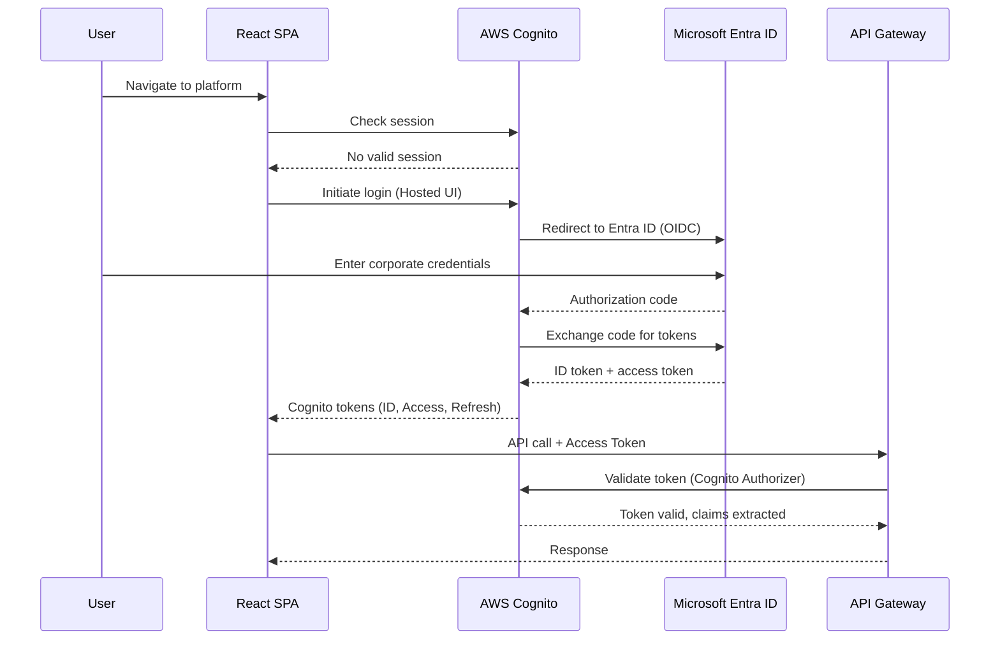
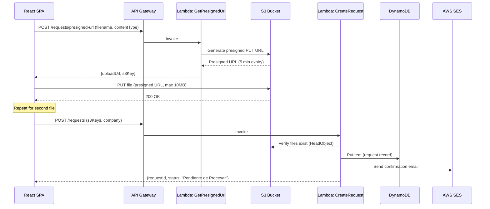
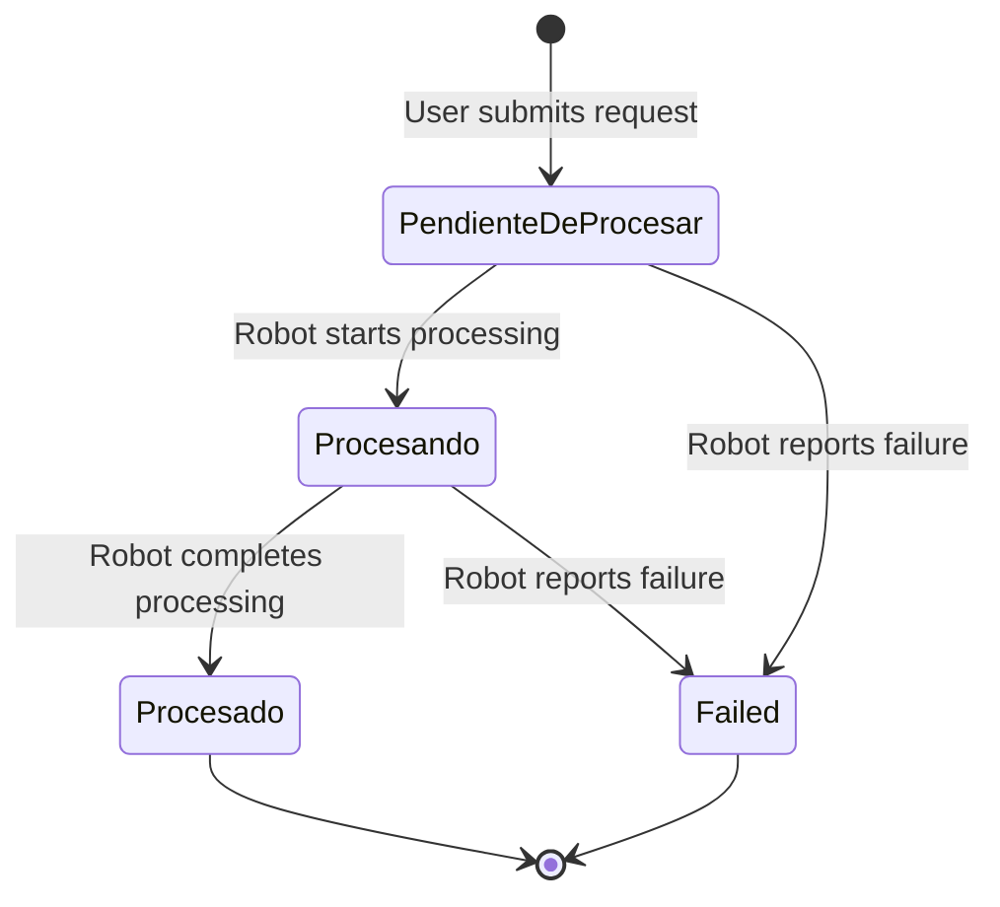

# Design Document: Purdy Renting Platform

## Overview

Purdy Renting is a serverless web platform for managing price list requests within the Purdy Motor and Automotriz companies in Costa Rica. The system enables corporate employees to submit requests with file attachments (.xls, .xlsx, .csv), track request processing status through an RPA-driven workflow, and receive email confirmations.

The platform follows a fully serverless architecture on AWS, with a React single-page application (SPA) frontend communicating through API Gateway to Python Lambda functions. Data is persisted in DynamoDB, files are stored in S3, authentication is handled by AWS Cognito federated with Microsoft Entra ID, and email notifications are delivered via AWS SES.

### Key Design Decisions

| Decision | Rationale |
|----------|-----------|
| S3 presigned URLs for file upload | Avoids routing file bytes through Lambda, reduces latency and cost, enforces size limits at S3 level |
| Cognito User Pool as OIDC bridge | Provides standard JWT tokens for API Gateway authorization while delegating identity to Entra ID |
| Single DynamoDB table design | Simplifies operations for the single-entity access pattern (requests by user) |
| API key authentication for Robot | Separates machine-to-machine auth from user auth, uses API Gateway usage plans |
| Spanish-only UI | Target audience is Costa Rican corporate employees; no i18n framework needed |

## Architecture

### High-Level Architecture Diagram



### Authentication Flow



### File Upload Flow



### Request Status Lifecycle



## Components and Interfaces

### Frontend Components

#### React Application Structure

```
src/
├── components/
│   ├── Auth/
│   │   └── ProtectedRoute.tsx
│   ├── Request/
│   │   ├── RequestForm.tsx
│   │   ├── FileUpload.tsx
│   │   └── CompanySelector.tsx
│   ├── Tracking/
│   │   ├── RequestTable.tsx
│   │   └── RequestRow.tsx
│   └── Layout/
│       ├── Header.tsx
│       └── ErrorBoundary.tsx
├── services/
│   ├── authService.ts
│   ├── requestService.ts
│   └── fileService.ts
├── hooks/
│   ├── useAuth.ts
│   └── useRequests.ts
├── types/
│   └── index.ts
└── config/
    └── aws-config.ts
```

#### Key Frontend Interfaces

```typescript
// types/index.ts

interface Request {
  requestId: string;
  userEmail: string;
  company: "Purdy Motor" | "Automotriz";
  companyCode: "PM" | "AUTO";
  listadoPreciosS3Key: string;
  daiS3Key: string;
  generatedFileName: string | null;
  generatedFileS3Key: string | null;
  status: "Pendiente de Procesar" | "Procesando" | "Procesado" | "Failed";
  observation: string | null;
  createdAt: string; // ISO 8601
  updatedAt: string; // ISO 8601
}

interface CreateRequestPayload {
  listadoPreciosS3Key: string;
  daiS3Key: string;
  company: "Purdy Motor" | "Automotriz";
}

interface PresignedUrlRequest {
  fileName: string;
  contentType: string;
  fileType: "listado_precios" | "dai";
}

interface PresignedUrlResponse {
  uploadUrl: string;
  s3Key: string;
}

interface CreateRequestResponse {
  requestId: string;
  message: string;
}
```

### Backend Lambda Functions

#### Lambda: GetPresignedUrl

**Purpose:** Generate presigned S3 PUT URLs for file uploads.

```python
# handlers/get_presigned_url.py

def handler(event, context) -> dict:
    """
    Generate a presigned S3 PUT URL for file upload.
    
    Input (body):
        fileName: str - Original filename
        contentType: str - MIME type (must be valid for .xls/.xlsx/.csv)
        fileType: str - "listado_precios" or "dai"
    
    Output:
        uploadUrl: str - Presigned PUT URL (expires in 300 seconds)
        s3Key: str - The S3 key where the file will be stored
    
    Auth: Cognito Authorizer (user email from claims)
    Errors:
        400 - Invalid file extension or content type
        401 - Unauthorized
    """
```

#### Lambda: CreateRequest

**Purpose:** Validate uploaded files and create a new request record.

```python
# handlers/create_request.py

def handler(event, context) -> dict:
    """
    Create a new request after files are uploaded.
    
    Input (body):
        listadoPreciosS3Key: str - S3 key of uploaded price list file
        daiS3Key: str - S3 key of uploaded DAI file
        company: str - "Purdy Motor" or "Automotriz"
    
    Output:
        requestId: str - UUID of the created request
        message: str - Confirmation message in Spanish
    
    Auth: Cognito Authorizer (user email from claims)
    
    Process:
        1. Validate S3 keys exist and belong to user (HeadObject)
        2. Validate file sizes <= 10 MB
        3. Generate UUID for request
        4. Write DynamoDB record with status "Pendiente de Procesar"
        5. Send confirmation email via SES (async, non-blocking)
        6. Return success response
    
    Errors:
        400 - Missing fields, invalid company, files not found in S3
        401 - Unauthorized
        500 - DynamoDB write failure (rollback S3 files)
    """
```

#### Lambda: GetRequests

**Purpose:** Retrieve all requests for the authenticated user.

```python
# handlers/get_requests.py

def handler(event, context) -> dict:
    """
    Get all requests for the authenticated user.
    
    Input: None (user email from Cognito claims)
    
    Output:
        requests: list[Request] - User's requests ordered by createdAt DESC
    
    Auth: Cognito Authorizer
    Errors:
        401 - Unauthorized
        500 - DynamoDB query failure
    """
```

#### Lambda: GetDownloadUrl

**Purpose:** Generate a presigned GET URL for downloading generated files.

```python
# handlers/get_download_url.py

def handler(event, context) -> dict:
    """
    Generate a presigned S3 GET URL for downloading a generated file.
    
    Input (path parameter):
        requestId: str - UUID of the request
    
    Output:
        downloadUrl: str - Presigned GET URL (expires in 600 seconds)
        fileName: str - Original filename for download
    
    Auth: Cognito Authorizer (validates user owns the request)
    Errors:
        401 - Unauthorized
        403 - Request belongs to different user
        404 - Request not found or no generated file
    """
```

#### Lambda: UpdateStatus (Robot API)

**Purpose:** Allow the Robot to update request processing status.

```python
# handlers/update_status.py

def handler(event, context) -> dict:
    """
    Update the status of a request (Robot-only endpoint).
    
    Input (body):
        requestId: str - UUID of the request
        status: str - "Procesando", "Procesado", or "Failed"
        observation: str (optional) - Error detail for Failed status (max 500 chars)
    
    Output:
        message: str - Confirmation message
        updatedAt: str - Timestamp of the update
    
    Auth: API Key (via API Gateway usage plan)
    Errors:
        400 - Invalid status value, observation too long
        401 - Missing or invalid API key
        404 - Request not found
        409 - Request already in terminal state (Procesado/Failed)
    """
```

#### Lambda: UploadGeneratedFile (Robot API)

**Purpose:** Allow the Robot to upload the generated Excel file.

```python
# handlers/upload_generated_file.py

def handler(event, context) -> dict:
    """
    Upload a generated file for a processed request (Robot-only endpoint).
    
    Input (body):
        requestId: str - UUID of the request
        fileContent: str - Base64-encoded file content
        fileName: str - Name for the generated file
    
    Output:
        message: str - Confirmation message
        s3Key: str - S3 key of the stored file
    
    Auth: API Key (via API Gateway usage plan)
    
    Process:
        1. Validate request exists
        2. Decode base64 content
        3. Validate decoded size <= 50 MB
        4. Upload to S3 with server-side encryption
        5. Update DynamoDB record with generatedFileName and generatedFileS3Key
    
    Errors:
        400 - Invalid base64, file exceeds 50 MB
        401 - Missing or invalid API key
        404 - Request not found
        500 - S3 storage failure (do NOT update DynamoDB)
    """
```

### API Gateway Routes

| Method | Path | Auth | Lambda | Description |
|--------|------|------|--------|-------------|
| POST | /requests/presigned-url | Cognito | GetPresignedUrl | Generate upload URL |
| POST | /requests | Cognito | CreateRequest | Create request |
| GET | /requests | Cognito | GetRequests | List user requests |
| GET | /requests/{id}/download | Cognito | GetDownloadUrl | Get download URL |
| PUT | /requests/{id}/status | API Key | UpdateStatus | Robot status update |
| POST | /requests/{id}/file | API Key | UploadGeneratedFile | Robot file upload |

### Email Notification Service

```python
# services/notification_service.py

def send_submission_confirmation(
    recipient_email: str,
    user_name: str,
    company_name: str,
    company_code: str,
    submission_date: str
) -> bool:
    """
    Send request submission confirmation email via SES.
    
    Email subject: "Listado Precios - {company_code}"
    Email body includes:
        - User name
        - Submission date (dd/MM/yyyy HH:mm format)
        - Company full name
    
    Retry: Up to 3 attempts with exponential backoff.
    Returns True on success, False after all retries exhausted.
    """
```

### Shared Utilities

```python
# utils/validators.py

ALLOWED_EXTENSIONS = {".xls", ".xlsx", ".csv"}
MAX_USER_FILE_SIZE = 10 * 1024 * 1024  # 10 MB
MAX_GENERATED_FILE_SIZE = 50 * 1024 * 1024  # 50 MB
VALID_COMPANIES = {"Purdy Motor": "PM", "Automotriz": "AUTO"}
VALID_STATUSES = {"Procesando", "Procesado", "Failed"}
TERMINAL_STATUSES = {"Procesado", "Failed"}
MAX_OBSERVATION_LENGTH = 500
MAX_TEXT_FIELD_LENGTH = 1000

def validate_file_extension(filename: str) -> bool:
    """Check if filename has an allowed extension."""

def validate_company(company: str) -> tuple[bool, str | None]:
    """Validate company and return (is_valid, company_code)."""

def validate_status_transition(current_status: str, new_status: str) -> bool:
    """Validate that the status transition is allowed."""

def sanitize_input(value: str, max_length: int = MAX_TEXT_FIELD_LENGTH) -> str:
    """Validate text input: length, no control chars, no script content."""

def format_date_cr(dt: datetime) -> str:
    """Format datetime as dd/MM/yyyy HH:mm for Costa Rican display."""
```

## Data Models

### DynamoDB Table: PurdyRentingRequests

**Table Design:** Single-table design with a Global Secondary Index for user queries.

| Attribute | Type | Description |
|-----------|------|-------------|
| PK | String | `REQUEST#{requestId}` |
| SK | String | `METADATA` |
| requestId | String | UUID v4 |
| userEmail | String | Authenticated user's email (from Cognito claims) |
| company | String | "Purdy Motor" or "Automotriz" |
| companyCode | String | "PM" or "AUTO" |
| listadoPreciosS3Key | String | S3 key for price list file |
| listadoPreciosFileName | String | Original filename of price list |
| daiS3Key | String | S3 key for DAI file |
| daiFileName | String | Original filename of DAI file |
| generatedFileName | String (nullable) | Name of Robot-generated file |
| generatedFileS3Key | String (nullable) | S3 key of Robot-generated file |
| status | String | Current status |
| observation | String (nullable) | Error detail from Robot (max 500 chars) |
| createdAt | String | ISO 8601 timestamp |
| updatedAt | String | ISO 8601 timestamp |
| GSI1PK | String | `USER#{userEmail}` |
| GSI1SK | String | `CREATED#{createdAt}` (enables sort by date) |

**Global Secondary Index (GSI1):**
- Partition key: `GSI1PK` (USER#{userEmail})
- Sort key: `GSI1SK` (CREATED#{createdAt})
- Projection: ALL
- Purpose: Efficiently query all requests by user, ordered by creation date

### S3 Bucket Structure

```
purdy-renting-files/
├── uploads/
│   └── {requestId}/
│       ├── listado_precios_{originalFilename}
│       └── dai_{originalFilename}
└── generated/
    └── {requestId}/
        └── {generatedFileName}
```

**Bucket Configuration:**
- Server-side encryption: AES-256 (SSE-S3)
- Block all public access: enabled
- CORS: Allow PUT from frontend domain (for presigned URL uploads)
- Lifecycle: Consider archival to Glacier after 365 days (business decision)

### S3 Key Format

```
uploads/{requestId}/listado_precios_{sanitized_filename}
uploads/{requestId}/dai_{sanitized_filename}
generated/{requestId}/{generated_filename}
```

### Cognito User Pool Configuration

- **Provider:** Microsoft Entra ID via OIDC
- **Token lifetime:** 60 minutes (ID and Access tokens)
- **Refresh token:** 30 days
- **Attribute mapping:** email, name from Entra ID claims
- **Hosted UI:** Enabled for login redirect
- **Callback URL:** `https://{domain}/callback`
- **Logout URL:** `https://{domain}/login`

## Correctness Properties

*A property is a characteristic or behavior that should hold true across all valid executions of a system — essentially, a formal statement about what the system should do. Properties serve as the bridge between human-readable specifications and machine-verifiable correctness guarantees.*

### Property 1: File extension validation consistency

*For any* filename string, the validation function shall accept it if and only if it ends with one of `.xls`, `.xlsx`, or `.csv` (case-insensitive), and reject all other extensions.

**Validates: Requirements 2.8, 3.5**

### Property 2: Company code mapping correctness

*For any* valid company selection, the mapping function shall produce "PM" for "Purdy Motor" and "AUTO" for "Automotriz", and shall reject any other input.

**Validates: Requirements 2.3, 5.2**

### Property 3: Status transition validity

*For any* request with a current status, the status update function shall allow transitions only from "Pendiente de Procesar" to "Procesando" or "Failed", and from "Procesando" to "Procesado" or "Failed"; all other transitions shall be rejected.

**Validates: Requirements 7.1, 7.2, 7.3, 7.6**

### Property 4: Date formatting round trip

*For any* valid datetime value, formatting it with `format_date_cr` and then parsing the result back shall produce a datetime equivalent to the original (truncated to minutes).

**Validates: Requirements 6.1, 9.3**

### Property 5: Input sanitization rejects dangerous content

*For any* string containing unescaped control characters or script content (e.g., `<script>`, JS event handlers), the sanitization function shall either strip the dangerous content or reject the input entirely, while preserving safe text content.

**Validates: Requirements 10.4**

### Property 6: User isolation on request queries

*For any* two distinct users A and B, querying requests for user A shall never return requests belonging to user B, regardless of the total number of requests in the system.

**Validates: Requirements 6.2, 10.3**

### Property 7: Observation field length enforcement

*For any* observation string provided by the Robot, if its length exceeds 500 characters, the update shall be rejected with a 400 error; otherwise, the full observation shall be stored without truncation.

**Validates: Requirements 7.3**

### Property 8: Presigned URL key uniqueness

*For any* two presigned URL generation requests (even with the same filename from the same user), the resulting S3 keys shall be distinct.

**Validates: Requirements 3.2**

### Property 9: Request record completeness

*For any* successfully created request, the resulting DynamoDB record shall contain all required fields: requestId (valid UUID), userEmail (non-empty), company, companyCode, both S3 file keys, status "Pendiente de Procesar", and a valid ISO 8601 createdAt timestamp.

**Validates: Requirements 4.1, 4.2**

### Property 10: Email subject format correctness

*For any* valid company code ("PM" or "AUTO"), the email notification subject shall exactly match the format "Listado Precios - {companyCode}".

**Validates: Requirements 5.2**

## Error Handling

### Error Response Format

All API error responses follow a consistent JSON structure:

```json
{
  "error": {
    "code": "ERROR_CODE",
    "message": "Mensaje descriptivo en español"
  }
}
```

### Error Codes and HTTP Status Mapping

| HTTP Status | Error Code | Scenario |
|-------------|-----------|----------|
| 400 | INVALID_FILE_FORMAT | File extension not .xls/.xlsx/.csv |
| 400 | FILE_TOO_LARGE | File exceeds size limit |
| 400 | MISSING_REQUIRED_FIELD | Required field not provided |
| 400 | INVALID_COMPANY | Company value not recognized |
| 400 | INVALID_STATUS | Status value not in allowed set |
| 400 | INVALID_BASE64 | Base64 decoding failed |
| 400 | OBSERVATION_TOO_LONG | Observation exceeds 500 characters |
| 400 | INVALID_INPUT | Control characters or script content detected |
| 401 | UNAUTHORIZED | Missing or invalid token/API key |
| 403 | FORBIDDEN | User accessing another user's resource |
| 404 | REQUEST_NOT_FOUND | Request ID does not exist |
| 409 | REQUEST_TERMINAL_STATE | Request already Procesado or Failed |
| 500 | STORAGE_ERROR | S3 operation failed |
| 500 | DATABASE_ERROR | DynamoDB operation failed |
| 500 | INTERNAL_ERROR | Unexpected server error |

### Retry and Rollback Strategies

| Operation | Failure Handling |
|-----------|-----------------|
| File upload (user) | Client-side retry via presigned URL; no server involvement |
| Request creation (DynamoDB fails) | Return error, preserve user form data, do NOT delete uploaded files (user can retry) |
| Email notification | 3 retries with exponential backoff (1s, 2s, 4s); log failure; show warning; do NOT block request |
| Robot file upload (S3 fails) | Return 500; do NOT update DynamoDB record |
| Robot status update (DynamoDB fails) | Return 500; Robot expected to retry |

### Frontend Error Handling

- All error messages displayed in Spanish
- Form validation errors shown inline next to the relevant field
- Network/server errors shown as toast notifications
- Session expiration triggers automatic redirect to login
- File upload progress indicator with ability to cancel

## Testing Strategy

### Unit Tests

**Framework:** pytest (backend), Jest + React Testing Library (frontend)

**Backend unit test coverage targets:**
- `validators.py` — All validation functions with boundary values
- `notification_service.py` — Email formatting and retry logic (mocked SES)
- Each Lambda handler — Happy path, validation errors, and edge cases (mocked AWS services using moto)

**Frontend unit test coverage targets:**
- Form validation logic
- Component rendering with various props
- Service functions (mocked API responses)
- Authentication state management

### Property-Based Tests

**Framework:** Hypothesis (Python)

**Configuration:** Minimum 100 iterations per property test

Each correctness property maps to a property-based test:

- **Feature: purdy-renting-platform, Property 1:** File extension validation — generate random strings with/without valid extensions
- **Feature: purdy-renting-platform, Property 2:** Company code mapping — generate all combinations including invalid inputs
- **Feature: purdy-renting-platform, Property 3:** Status transitions — generate random (current_status, new_status) pairs and verify only valid transitions succeed
- **Feature: purdy-renting-platform, Property 4:** Date formatting round trip — generate random datetimes within business range
- **Feature: purdy-renting-platform, Property 5:** Input sanitization — generate strings with embedded script tags, control characters, mixed content
- **Feature: purdy-renting-platform, Property 6:** User isolation — generate random request sets for multiple users and verify query isolation
- **Feature: purdy-renting-platform, Property 7:** Observation length enforcement — generate strings of varying length around the 500-char boundary
- **Feature: purdy-renting-platform, Property 8:** S3 key uniqueness — generate repeated requests with same parameters and verify distinct keys
- **Feature: purdy-renting-platform, Property 9:** Request record completeness — generate valid request inputs and verify all output fields present and valid
- **Feature: purdy-renting-platform, Property 10:** Email subject format — generate valid company codes and verify subject string format

### Integration Tests

**Framework:** pytest with moto (AWS service mocking) for backend; Cypress for frontend E2E

**Key integration test scenarios:**
- Full request creation flow (upload → create → verify DynamoDB + S3)
- Authentication flow with token refresh
- Robot API flow (status update → file upload → verify state)
- Access control enforcement (user A cannot see user B's requests)
- Error scenarios (S3 failure, DynamoDB failure, invalid tokens)

### E2E Tests

**Framework:** Cypress

**Key scenarios:**
- Login via Cognito/Entra ID (stubbed identity provider)
- Create request with file upload and form submission
- View request tracking table with various statuses
- Download generated file
- Session timeout and re-authentication
